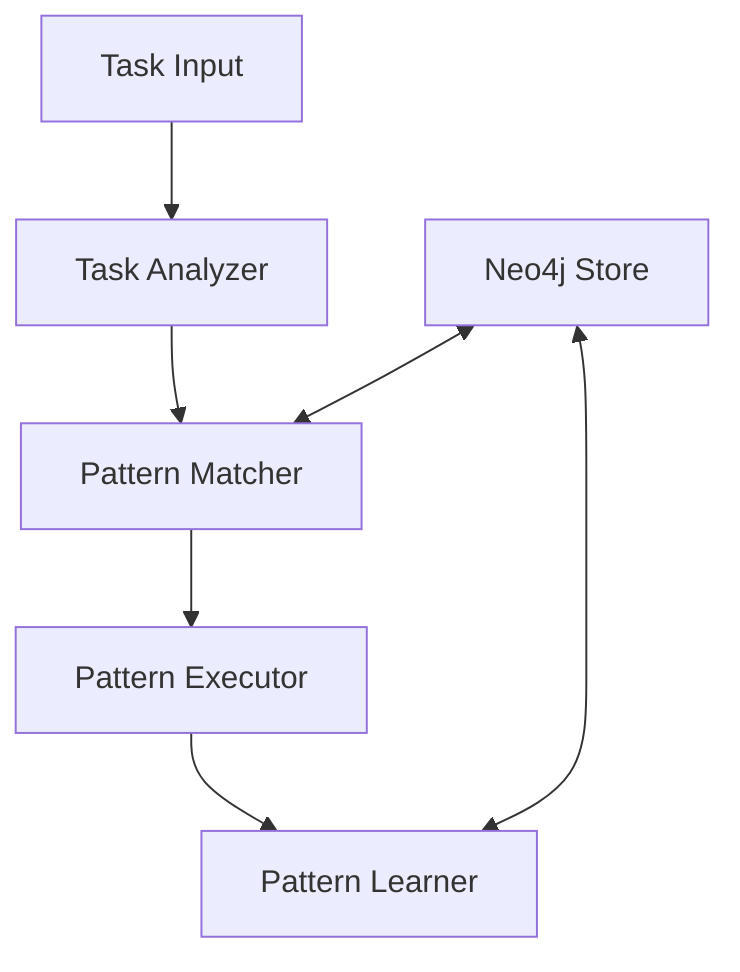

# Pattern Learning System

A sophisticated system that learns and reuses task execution patterns to solve similar problems efficiently. It combines hierarchical task planning, pattern matching, and continuous learning to improve task execution over time.

## Features

### Pattern Management
- Abstract pattern representation
- Multi-level pattern hierarchy
- Pattern adaptation and variation
- Success rate tracking
- Continuous learning from executions

### Intelligence
- Task analysis and decomposition
- Semantic and structural matching
- AI-powered pattern adaptation
- Context-aware execution
- Learning from successes and failures

### System Components
- Pattern Store (Neo4j-based)
- Task Analyzer
- Pattern Matcher
- Pattern Executor
- Pattern Learner

## Installation

1. Set up Python environment:
```bash
# Clone the repository
git clone [repository-url]
cd pattern-learning-system

# Install Python dependencies
./start_pattern_system.sh
```

2. Configure Neo4j:
```bash
# Install Neo4j if not already installed
brew install neo4j  # macOS
# or
sudo apt install neo4j  # Ubuntu

# Start Neo4j service
neo4j start

# Set password (first time)
neo4j-admin set-initial-password your-password
```

3. Configure environment:
```bash
# Copy example configuration
cp .env.example .env

# Edit .env with your settings
nano .env
```

## Usage

### Starting the System
```bash
# Initialize and start the system
./start_pattern_system.sh
```

### Running the Demo
```bash
# Run the task execution demo
python examples/task_execution_demo.py
```

### Managing Patterns
```bash
# Initialize pattern database
python scripts/setup_pattern_system.py --action clean

# Backup patterns
python scripts/setup_pattern_system.py --action backup

# Analyze pattern usage
python scripts/setup_pattern_system.py --action analyze
```

### Monitoring
```bash
# Live system monitor
python scripts/monitor_system.py

# Export statistics
python scripts/monitor_system.py --export stats.json
```

## Pattern Structure

### Abstract Pattern
```json
{
  "id": "abstract_pattern_id",
  "name": "Generic Pattern Name",
  "concepts": ["concept1", "concept2"],
  "description": "Pattern description",
  "steps": [
    {
      "type": "action_type",
      "description": "${variable} description",
      "required_capabilities": ["capability1"],
      "validation": {
        "type": "validation_type",
        "description": "Validation description"
      }
    }
  ],
  "abstraction_level": 3,
  "success_rate": 1.0,
  "executions": 0
}
```

### Concrete Pattern
```json
{
  "id": "concrete_pattern_id",
  "name": "Specific Pattern Name",
  "concepts": ["specific_concept"],
  "parent_pattern": "abstract_pattern_id",
  "steps": [
    {
      "type": "specific_action",
      "description": "Concrete step description",
      "required_capabilities": ["specific_capability"],
      "validation": {
        "type": "specific_validation",
        "selector": ".specific-element"
      }
    }
  ],
  "abstraction_level": 1,
  "success_rate": 0.95,
  "executions": 100
}
```

## System Architecture



## Development

### Running Tests
```bash
# Run all tests
pytest tests/

# Run specific test suite
pytest tests/test_pattern_workflow.py
```

### Adding New Patterns
1. Create pattern definition:
```python
pattern = {
    "id": "your_pattern_id",
    "name": "Pattern Name",
    "concepts": ["concept1", "concept2"],
    "steps": [
        # Define steps
    ]
}
```

2. Store pattern:
```python
from src.kb.pattern_store import PatternStore

store = PatternStore(uri, user, password)
pattern_id = await store.store_pattern(pattern)
```

## Monitoring and Management

### Live Monitoring
The system provides real-time monitoring of:
- Pattern usage statistics
- Success rates and trends
- Pattern distribution
- Recent updates
- System health

### Pattern Management
Tools are provided for:
- Pattern backup and restore
- Usage analysis
- Database maintenance
- Performance monitoring

## Best Practices

1. Pattern Design
- Keep patterns abstract where possible
- Include clear validation steps
- Define required capabilities
- Document pattern purpose

2. Pattern Usage
- Start with abstract patterns
- Create variations for specific cases
- Monitor success rates
- Clean up unused patterns

3. System Maintenance
- Regular backups
- Monitor performance
- Clean database periodically
- Update pattern metrics

## Troubleshooting

Common issues and solutions:

1. Connection Issues
```bash
# Check Neo4j connection
python scripts/setup_pattern_system.py --action check
```

2. Pattern Matching Issues
- Verify pattern concepts
- Check abstraction levels
- Review success rates

3. Performance Issues
- Monitor system stats
- Clean unused patterns
- Optimize database indexes

## Contributing

1. Fork the repository
2. Create feature branch
3. Implement changes
4. Add tests
5. Submit pull request

## License

MIT License - see LICENSE file for details
