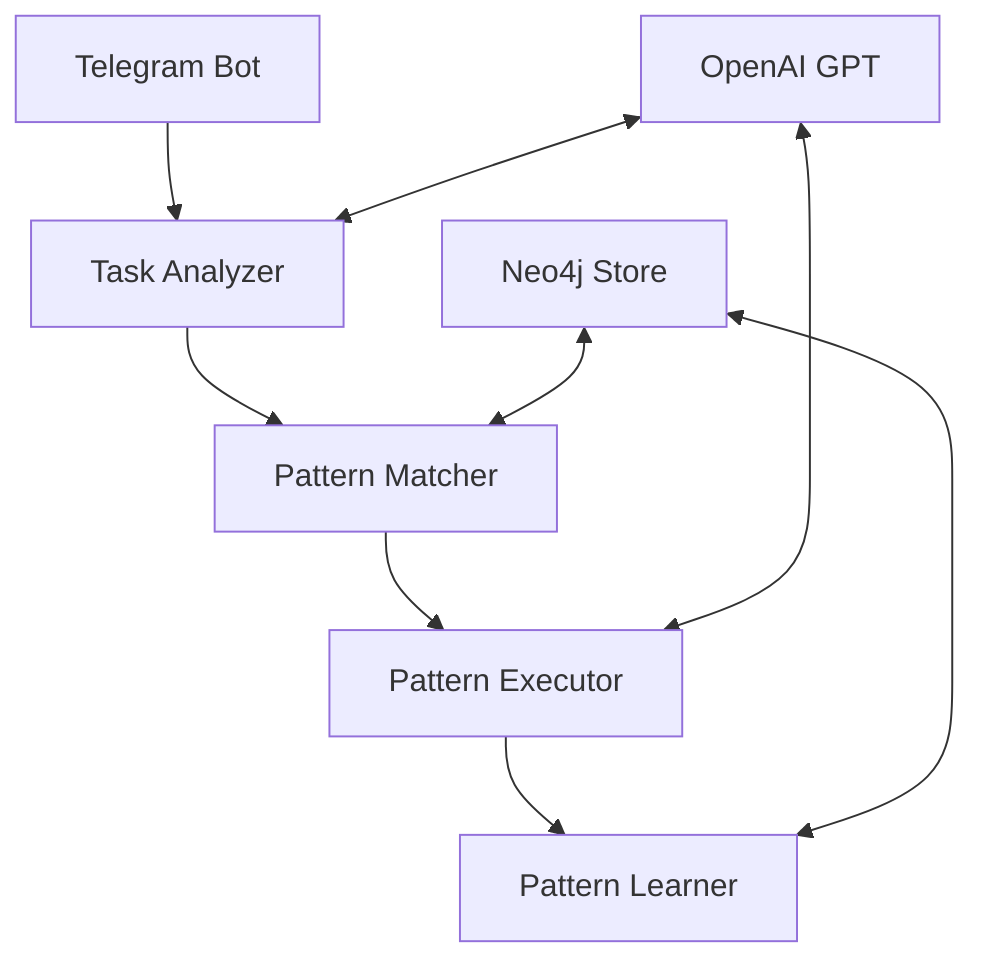

# Universal AI Assistant 🤖

An intelligent AI assistant that learns and evolves through pattern recognition, powered by OpenAI's GPT models and a sophisticated pattern learning system. The assistant can handle complex tasks by learning from previous interactions and adapting its strategies.

## Key Features

### 🧠 Pattern Learning System
- Learns from each interaction to improve future task execution
- Stores and reuses successful patterns
- Adapts patterns based on context and feedback
- Continuous improvement through user interactions

### 🌐 Task Execution
- Natural language task understanding
- Pattern-based task decomposition
- Dynamic strategy adaptation
- Success rate tracking and optimization

### 🔍 Pattern Matching
- Semantic and structural pattern matching
- Context-aware pattern selection
- Hybrid matching strategies
- Pattern abstraction and reuse

### 🤖 Telegram Bot Interface
- Easy-to-use chat interface
- Real-time task progress tracking
- Interactive feedback collection
- Secure authentication

## System Components

### Core Components
- Pattern Store (Neo4j-based)
- Task Analyzer
- Pattern Matcher & Executor
- Learning System
- Telegram Bot Server

### Intelligence Layer
- Abstraction Agent
- Pattern Search Agent
- Task Execution Engine
- Progress Tracker

## Installation

1. Clone the repository:
```bash
git clone https://github.com/TarnbirSingh/Universal-AI-Assistant.git
cd Universal-AI-Assistant
```

2. Install dependencies:
```bash
pip install -r requirements.txt
```

### Dependencies Overview
- **Core AI & ML**:
  - `openai`: OpenAI API client
  - `autogen_ext`, `autogen_agentchat`, `autogen_core`: Autonomous agent framework
  - `playwright`: Web automation for task execution
  - `transformers`, `torch`: Machine learning support

- **Database & Storage**:
  - `neo4j`: Graph database for pattern storage
  - `chromadb`: Vector database for semantic search
  - `networkx`: Graph processing

- **Web & API**:
  - `fastapi`: API framework
  - `uvicorn`: ASGI server
  - `python-telegram-bot`: Telegram bot API
  - `aiohttp`, `httpx`: Async HTTP clients

- **Pattern Matching**:
  - `rapidfuzz`: Fuzzy string matching
  - `python-Levenshtein`: String similarity metrics
  - `scikit-learn`: Machine learning utilities

3. Set up Neo4j database:
```bash
# Install Neo4j if not already installed
brew install neo4j  # macOS
# or
sudo apt install neo4j  # Ubuntu

# Start Neo4j service
neo4j start
```

4. Configure environment:
```bash
# Copy example configuration
cp .env.example .env

# Edit .env with your settings:
# - OpenAI API key
# - Neo4j credentials
# - Telegram bot token
```

## Usage

Start the assistant:
```bash
python -m src.main
```

The system will:
1. Initialize the pattern learning system
2. Connect to Neo4j database
3. Start the Telegram bot
4. Begin processing user requests

## Architecture



## Pattern System

### Pattern Structure
```json
{
    "id": "pattern_id",
    "name": "Pattern Name",
    "description": "Pattern description",
    "steps": [
        {
            "type": "step_type",
            "description": "Step description",
            "context": {
                "action_type": "action",
                "parameters": {}
            }
        }
    ],
    "success_rate": 0.95,
    "executions": 100
}
```

### Pattern Types
- Task Patterns: Common task execution sequences
- Interaction Patterns: User communication strategies
- Search Patterns: Information retrieval methods
- Analysis Patterns: Data processing approaches

## Configuration

### Environment Variables
- `OPENAI_API_KEY`: Your OpenAI API key
- `OPENAI_MODEL`: GPT model to use (default: gpt-4)
- `NEO4J_URI`: Neo4j database URI
- `NEO4J_USER`: Neo4j username
- `NEO4J_PASSWORD`: Neo4j password
- `TELEGRAM_TOKEN`: Telegram bot token
- `TEMP_DIR`: Directory for temporary files (default: tmp/screenshots)
- `DEBUG`: Enable debug logging (default: false)

## Development

### Running Tests
```bash
pytest
```

### Code Structure
```
src/
├── agents/             # AI agents
│   ├── abstraction_agent.py    # Pattern abstraction
│   └── pattern_search_agent.py # Pattern matching
├── kb/                # Knowledge base
│   ├── graph_store.py   # Neo4j interface
│   ├── hybrid_kb.py     # Combined storage
│   └── pattern_store.py # Pattern management
├── pattern_matching/  # Pattern matching
├── server/           # Telegram bot
├── types/            # Type definitions
└── utils/            # Utilities
```

### Contributing
1. Fork the repository
2. Create a feature branch
3. Make your changes
4. Add tests
5. Submit a pull request

## License

MIT License - See LICENSE file for details
